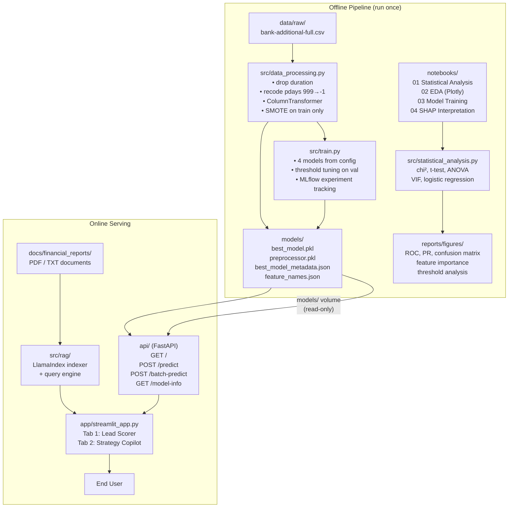

# FinSight AI — System Architecture

## Overview

FinSight AI is a production-grade machine learning pipeline that predicts whether a bank customer will subscribe to a term deposit. The system ingests raw campaign data, applies statistically-principled feature engineering through a serialised `ColumnTransformer`, trains and compares four classifiers under MLflow experiment tracking, and exposes predictions through a FastAPI service backed by a Streamlit dashboard. A LlamaIndex RAG component allows campaign strategists to query internal financial documents in natural language alongside the ML predictions.

---

## Component Diagram



### API Request Flow

```
POST /predict
─────────────────────────────────────────────────────────────
  JSON payload  →  Pydantic CustomerInput (validation + alias)
                →  model_dump(by_alias=True)   [keeps emp.var.rate dots]
                →  pdays 999 → -1 recode        [mirror training recode]
                →  pd.DataFrame(1 row)
                →  preprocessor.transform()     [same ColumnTransformer]
                →  best_model.predict_proba()
                →  apply tuned_threshold from metadata.json
                →  {probability, class, recommendation, threshold_used}
```

---

## Key Design Decisions

### 1. Saved `ColumnTransformer` (training/serving skew prevention)
The single most important production safety measure. By fitting `StandardScaler`, `OrdinalEncoder`, and `OneHotEncoder` **only on `X_train`** and serialising the result to `models/preprocessor.pkl`, every prediction at inference time passes through the identical transformation the model was trained on. The previous implementation used `pd.get_dummies()` per request, which produced different column sets depending on which categories appeared in that single row — a silent correctness bug.

### 2. `pdays = 999 → -1` recode
`pdays = 999` is a sentinel meaning "client was never previously contacted", not an actual day count. Leaving it as `999` would cause `StandardScaler` to interpret it as an extreme outlier (≈ 70× the real maximum of ~27 days), distorting the scaled feature for every tree split and every linear coefficient. Recoding to `-1` cleanly separates the binary flag (`-1` = never contacted) from the continuous count.

### 3. Drop `duration` (data leakage)
`duration` is the call length in seconds — information that only exists *after* the call ends, at which point the outcome is already known. Including it produces unrealistically high benchmark scores but a model that cannot be used pre-call in production. It is dropped in `load_raw()` before any other processing.

### 4. PR-AUC as model selection metric (not ROC-AUC)
The dataset has ~11% positive class rate. ROC-AUC is inflated by the large number of true negatives, making even weak models appear strong. Precision-Recall AUC directly measures performance on the minority class and is the correct ranking metric when the cost of missing a positive (failed lead conversion) significantly exceeds the cost of a false positive (unnecessary call). All four models are ranked and the best model saved by `val_pr_auc`.

### 5. Threshold tuning on the validation set
The default `predict_proba > 0.5` threshold is arbitrary and suboptimal for imbalanced data. The actual best threshold varies widely by model: from `0.23` (LightGBM) to `0.84` (XGBoost). The tuning grid searches `[0.10, 0.90]` in steps of `0.01` on the held-out **validation set only**. The test set is never used during tuning — it is reserved for the final unbiased evaluation. The tuned threshold is stored in `best_model_metadata.json` and read by the API at startup — no hardcoded numbers anywhere in serving code.

### 6. SMOTE applied only to training data
Oversampling is a data augmentation technique that generates synthetic minority-class examples. Applying it before the train/val/test split would synthesise samples from test-set neighbourhoods, making evaluation metrics falsely optimistic (synthetic test samples are easier to classify than real ones). SMOTE is called only on `X_train_transformed` in `data_processing.py`, strictly after all splits.

### 7. `OrdinalEncoder` for `education` (preserve semantic order)
Education has a natural progression: `illiterate < basic.4y < basic.6y < basic.9y < high.school < professional.course < university.degree`. `OneHotEncoder` would discard this ordering and produce 7 orthogonal dummy columns. `OrdinalEncoder` with the explicit category list maps the progression to integers `[0..6]`, letting tree models make meaningful split decisions like "education < high.school" and linear models assign monotonically increasing coefficients.

---

## Technology Stack

| Layer | Technology | Purpose |
|---|---|---|
| Data processing | pandas, scikit-learn `ColumnTransformer` | Loading, recoding, scaling, encoding |
| Imbalance handling | imbalanced-learn SMOTE | Synthetic minority oversampling |
| ML models | scikit-learn, XGBoost, LightGBM | Classification |
| Experiment tracking | MLflow | Parameter/metric logging, model registry |
| Model interpretation | SHAP | Feature importance, decision explanation |
| Statistical analysis | SciPy, statsmodels | Hypothesis tests, VIF, logistic summary |
| Visualisation | Plotly, Matplotlib, Seaborn | Interactive EDA, static reports |
| API | FastAPI + Uvicorn | REST prediction service |
| Data validation | Pydantic v2 | Input schema, alias handling |
| Dashboard | Streamlit | Interactive UI |
| RAG | LlamaIndex + HuggingFace embeddings | Document QA over financial reports |
| Containerisation | Docker (multi-stage) + Compose | Reproducible deployment |
| CI | GitHub Actions + ruff + pytest | Lint and test on every push |

---

## API Endpoints Reference

| Method | Path | Description | Response |
|---|---|---|---|
| `GET` | `/` | Health check + model info | `{status, model_loaded, model_name, val_pr_auc, tuned_threshold, trained_at}` |
| `POST` | `/predict` | Single-customer prediction | `{probability_of_subscription, prediction_class, recommendation, threshold_used}` |
| `POST` | `/batch-predict` | Batch predictions (array input) | `[{...}, {...}]` — same schema per item |
| `GET` | `/model-info` | Full metadata JSON | Contents of `best_model_metadata.json` |

**Input schema** (`POST /predict`): 19 fields — 7 demographic, 7 campaign-history, and 5 macro-economic indicators. Macro fields use dot notation as aliases (`emp.var.rate`, `cons.price.idx`, `cons.conf.idx`, `nr.employed`) to match raw dataset column names.

---

## Deployment

```
                        ┌──────────────────┐
                        │  docker compose  │
         ┌──────────────┴──────────────────┴──────────────┐
         │                                                  │
    :8000│  finsight_api (FastAPI)    finsight_streamlit   │:8501
         │       ↑                         ↑               │
         │  models/ (read-only bind mount)  │               │
         │       │                         │               │
         │  finsight_mlflow              :5000              │
         │                                                  │
         └──────────────────────────────────────────────────┘
                         finsight (bridge network)
```

- `models/` is a **bind-mount**, not baked into the image. Swap a retrained model by replacing the file and restarting the API container — no rebuild required.
- Streamlit waits for the API's `service_healthy` condition before starting, preventing the "connection refused" splash on cold start.
- The MLflow service is optional and can be commented out when not running experiments.
