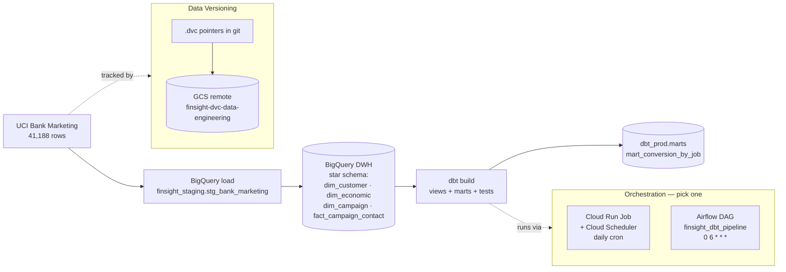

# FinSight — Cloud-Native Data Engineering on GCP

A production-style analytics pipeline that lands the UCI Bank Marketing dataset in a BigQuery star-schema warehouse, transforms it with dbt, and runs on two interchangeable orchestrators (Cloud Run Job + Cloud Scheduler, or local Airflow). Data assets are versioned with DVC against a GCS remote, and the whole stack is authenticated without a single exported service-account key.

---

## Tech Stack

| Layer | Tool |
|---|---|
| Warehouse | BigQuery (region `europe-west1`) |
| Transformation | dbt Core 1.11 (`dbt-bigquery==1.11.1`) |
| Container runtime | Docker, Artifact Registry, Cloud Run Jobs |
| Scheduling | Cloud Scheduler (managed), Apache Airflow 2.10.4 (local alternative) |
| Data versioning | DVC with GCS remote (`gs://finsight-dvc-data-engineering`) |
| IaC / Auth | gcloud, IAM role bindings, Application Default Credentials |
| Language | Python 3.11, SQL |

---

## Architecture



<!-- screenshot: BigQuery DWH schema (dim_* + fact_campaign_contact) -->

---

## The dbt Layer

The project lives under `finsight_dbt/` and follows the standard dbt layout. Configuration in `dbt_project.yml`:

```yaml
models:
  finsight_dbt:
    staging:
      +materialized: view
      +schema: staging
    marts:
      +materialized: table
      +schema: marts
```

### Models

| Model | Type | Purpose |
|---|---|---|
| `stg_bank_marketing` | view | Selects from `finsight_staging.stg_bank_marketing`, renames into analytic column groups (demographics, financial flags, campaign contact, economic context), casts the `subscribed` target to `INT64`. |
| `mart_conversion_by_job` | table | Aggregates conversion rate per job segment from the staging view. Output: `job`, `total_contacts`, `total_subscribers`, `conversion_pct`. |

### Sources

Declared in `models/staging/_sources.yml`:

- `finsight_staging.stg_bank_marketing` — raw loaded table
- `finsight_dwh.{dim_customer, dim_economic, dim_campaign, fact_campaign_contact}` — star-schema DWH

### Tests (6 total)

| Model | Column | Tests |
|---|---|---|
| `stg_bank_marketing` | `subscribed` | `not_null`, `accepted_values: [0, 1]` |
| `stg_bank_marketing` | `age` | `not_null` |
| `mart_conversion_by_job` | `job` | `not_null`, `unique` |
| `mart_conversion_by_job` | `conversion_pct` | `not_null` |

<!-- screenshot: dbt test pass (all 6 PASS in terminal) -->

### Targets — dev / prod split

Two BigQuery targets keep the developer iteration loop isolated from the scheduled production build:

| Target | Dataset | Used by |
|---|---|---|
| `dev` | `dbt_nika_dev` | Local interactive runs |
| `prod` | `dbt_prod` | Cloud Run Job + Airflow DAG |

The committed `profiles.yml` ships the `prod` target; the `dev` target lives in the developer's local `~/.dbt/profiles.yml` so the repo never carries personal dataset names.

---

## Orchestration

Two approaches are wired up. Both run the same `dbt build` against the same warehouse — they differ only in where the scheduler lives.

### 1) Cloud Run Job + Cloud Scheduler (serverless, managed)

`finsight_dbt/Dockerfile` packages dbt and the project:

```dockerfile
FROM python:3.11-slim
ENV PYTHONUNBUFFERED=1 \
    DBT_PROFILES_DIR=/app \
    GOOGLE_CLOUD_PROJECT=finsight-data-engineering
WORKDIR /app
RUN pip install --no-cache-dir dbt-bigquery==1.11.1
COPY . /app
CMD ["dbt", "build", "--no-partial-parse"]
```

Build locally (forcing `linux/amd64` because the dev machine is Apple Silicon and Cloud Run runs amd64), push to Artifact Registry, deploy as a Cloud Run Job, and trigger it on a daily Cloud Scheduler cron:

```bash
# Authenticate Docker against Artifact Registry (once)
gcloud auth configure-docker europe-west1-docker.pkg.dev

# Build for the Cloud Run target architecture, then push
IMAGE=europe-west1-docker.pkg.dev/finsight-data-engineering/finsight-docker/finsight-dbt:latest
docker build --platform linux/amd64 -t "$IMAGE" finsight_dbt
docker push "$IMAGE"

# Create the Cloud Run Job, bound to the dbt-runner service account
gcloud run jobs create finsight-dbt-job \
  --image "$IMAGE" \
  --region europe-west1 \
  --service-account dbt-runner@finsight-data-engineering.iam.gserviceaccount.com

# Manual execution
gcloud run jobs execute finsight-dbt-job --region europe-west1

# Daily schedule (06:00 Asia/Tbilisi)
gcloud scheduler jobs create http finsight-dbt-daily \
  --schedule "0 6 * * *" \
  --time-zone "Asia/Tbilisi" \
  --uri "https://run.googleapis.com/v2/projects/finsight-data-engineering/locations/europe-west1/jobs/finsight-dbt-job:run" \
  --http-method POST \
  --oauth-service-account-email dbt-runner@finsight-data-engineering.iam.gserviceaccount.com \
  --location europe-west1
```

<!-- screenshot: Cloud Run Job execution succeeded -->

### 2) Local Airflow (Docker, standalone)

The Composer-free alternative — same dbt build, orchestrated as an Airflow DAG. Useful for local development and for environments where managed Composer is overkill.

`airflow/Dockerfile`:

```dockerfile
FROM apache/airflow:2.10.4-python3.11
USER root
RUN apt-get update && apt-get install -y --no-install-recommends git \
    && rm -rf /var/lib/apt/lists/*
USER airflow
RUN pip install --no-cache-dir dbt-bigquery==1.11.1
```

`airflow/docker-compose.yml` mounts the dbt project and host ADC into the container — no keys baked into the image:

```yaml
volumes:
  - ./dags:/opt/airflow/dags
  - ../finsight_dbt:/opt/dbt
  - ~/.config/gcloud/application_default_credentials.json:/opt/adc.json:ro
```

DAG `finsight_dbt_pipeline` (`airflow/dags/finsight_dbt_dag.py`): `dbt_debug` → `dbt_build`, schedule `0 6 * * *`.

Run it:

```bash
cd airflow
docker compose up --build
# Airflow UI at http://localhost:8080  (standalone prints the admin password to stdout)
```

<!-- screenshot: Airflow Graph view (green run) -->

---

## DVC — Data Versioning on GCS

Raw and processed datasets are tracked by DVC, pushed to a GCS remote, and referenced from git via tiny `.dvc` pointer files.

`.dvc/config`:

```ini
[core]
    remote = gcsremote
['remote "gcsremote"']
    url = gs://finsight-dvc-data-engineering
```

Tracked artifacts:

| Pointer | Size | Files | MD5 |
|---|---|---|---|
| `data/raw.dvc` | 5.84 MB | 2 (`bank-additional-full.csv`, `bank-additional-names.txt`) | `4550a5ba3979de0fc9f27d47d6624f96.dir` |
| `data/processed.dvc` | 2.99 MB | 3 parquets (`train`, `val`, `test`) | `dfad733707ee3c046b4427b1de3e1f5c.dir` |

### Round-trip demo (restore from a clean clone)

```bash
git clone <repo> finsight && cd finsight
gcloud auth application-default login        # ADC for the GCS remote
pip install "dvc[gs]"
dvc pull                                      # rehydrates data/raw + data/processed from GCS
```

<!-- screenshot: DVC round-trip (dvc pull restoring data/) -->

---

## Security: a Deliberate Key-Free Design

The GCP org enforces `constraints/iam.disableServiceAccountKeyCreation`. That policy blocked the path of least resistance — downloading a `key.json` and shipping it around — and forced the project onto the secure path from day one. Rather than fight the constraint, I leaned into it:

| Surface | Mechanism | Why this is the right choice |
|---|---|---|
| Local dbt runs | Application Default Credentials (`gcloud auth application-default login`) | Tied to my human identity; revocable; nothing on disk to leak. |
| Local DVC pull/push | Same ADC, reused | One credential surface, audited the same way. |
| Cloud Run Job execution | Runtime service account `dbt-runner` attached to the job | Google-managed credentials minted just-in-time; no static secret exists. |
| Cloud Scheduler → Cloud Run | OAuth invocation using `dbt-runner` SA | Scheduler proves identity via Google-signed token, not a shared secret. |
| Airflow container | Host ADC mounted read-only at `/opt/adc.json` | Image contains no credentials; the credential never leaves the developer machine. |
| BigQuery access (dbt) | IAM role bindings on `dbt-runner`: `roles/bigquery.dataEditor`, `roles/bigquery.jobUser` | Least-privilege, revocable per-resource, no keys to rotate. |
| GCS access (DVC) | My human identity via ADC (no service account involved) | DVC push/pull is a developer operation; routing it through ADC keeps the audit trail tied to a real person. |

Net result: zero exported service-account keys exist for this project — in the repo, on my disk, or in the container images. Credential lifecycle is delegated to Google IAM, which is exactly where it belongs.

---

## Skills Demonstrated

- **BigQuery warehouse design** — star schema (3 dims + 1 fact), regional placement (`europe-west1`), source/staging/mart separation.
- **dbt Core in production** — sources, refs, materializations, dev/prod target split, schema tests with `not_null` / `unique` / `accepted_values`.
- **Containerization** — minimal Python 3.11 slim image for dbt; reproducible Airflow image with pinned `dbt-bigquery==1.11.1`.
- **Serverless orchestration on GCP** — Artifact Registry → Cloud Run Job → Cloud Scheduler, all driven by a runtime service account.
- **Workflow orchestration with Airflow** — standalone Docker setup, BashOperator DAG with task dependencies, idiomatic daily cron schedule.
- **Data versioning** — DVC with a GCS remote, git-tracked `.dvc` pointers, demonstrable clean-clone restore.
- **GCP IAM / security** — operating under an org policy that disables SA key creation; designing exclusively around ADC, runtime service accounts, and IAM role bindings.
- **Cloud-native cost discipline** — choosing Cloud Run Jobs over always-on Composer for a daily batch workload.

---

## Project Layout (relevant slices)

```
finsight_dbt/
├── dbt_project.yml
├── profiles.yml                 # prod target only — dev lives in ~/.dbt
├── Dockerfile                   # Cloud Run Job image
├── models/
│   ├── staging/
│   │   ├── _sources.yml
│   │   ├── _models.yml
│   │   └── stg_bank_marketing.sql
│   └── marts/
│       ├── _models.yml
│       └── mart_conversion_by_job.sql
airflow/
├── Dockerfile
├── docker-compose.yml
└── dags/finsight_dbt_dag.py
data/
├── raw.dvc                      # pointer → GCS
└── processed.dvc                # pointer → GCS
.dvc/config                      # GCS remote
```
